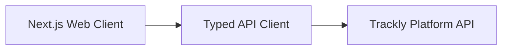

# trackly-web


Curated public snapshot of the authenticated Trackly web app.

## What This Repo Shows

- App Router architecture with authenticated route patterns
- Type-safe API client integration
- Responsive dashboard, tracker, and profile experiences
- Product-focused UI system with accessibility-oriented components

## Screenshots (Placeholders)

- `./screenshots/web-dashboard.png`
- `./screenshots/web-mobile.png`

## Architecture Snapshot



## Setup

1. Copy `.env.example` to `.env.local`.
2. Install dependencies: `npm install`.
3. Run locally: `npm run dev`.

Public placeholder API host:

```env
NEXT_PUBLIC_API_URL=https://api.track-ly.app/api
```

## Intentionally Private / Redacted

- Production credentials and secrets
- Internal backend implementation details
- Proprietary automation internals

## Notes

This is a public portfolio mirror and may lag behind private development.
